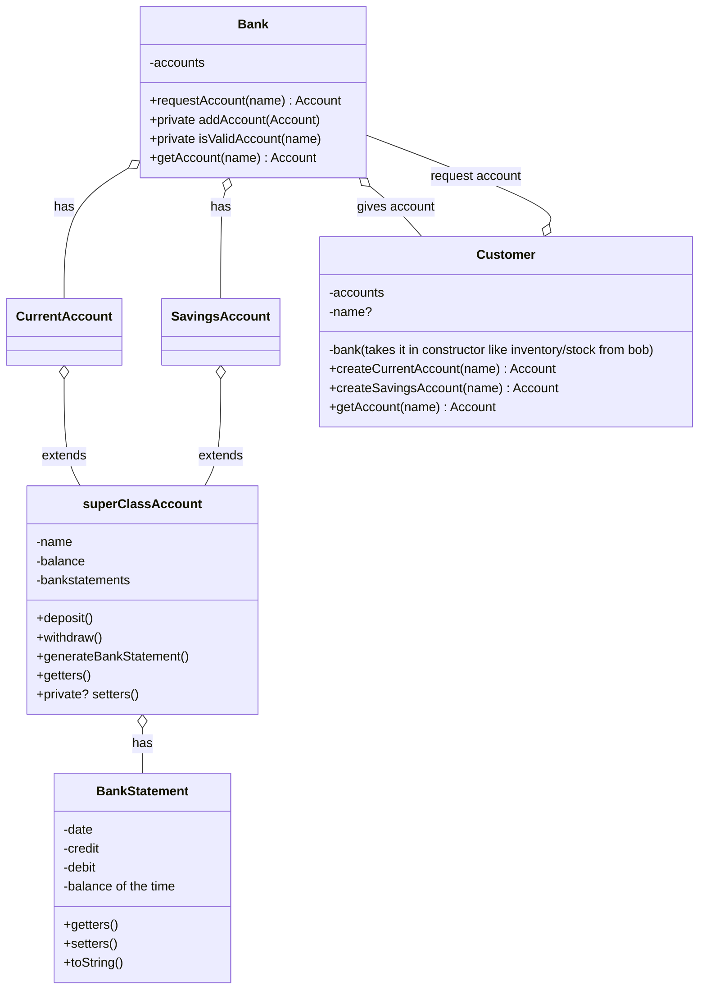

```mermaid
    classDiagram

        class Bank{
            -accounts

            +requestAccount(name) Account
            +private addAccount(Account)
            +private isValidAccount(name)
            +getAccount(name) Account
        }

        class superClassAccount {
            -name
            -balance
            -bankstatements

            +deposit()
            +withdraw()
            +generateBankStatement()
            +getters()
            +private? setters()
        }

        class BankStatement{
            -date
            -credit
            -debit
            -balance of the time

            +getters()
            +setters()
            +toString()
        }

        class CurrentAccount{
        }

        class SavingsAccount{
        }

        class Customer{
            -accounts
            -bank (takes it in constructor like inventory/stock from bob)
            -name?

            +createCurrentAccount(name) Account
            +createSavingsAccount(name) Account
            +getAccount(name) Account
        }

        superClassAccount o-- BankStatement: has
        CurrentAccount o-- superClassAccount: extends
        SavingsAccount o-- superClassAccount: extends

        Bank o-- CurrentAccount: has
        Bank o-- SavingsAccount: has

        Bank o-- Customer: gives account
        Customer o-- Bank: request account


```
