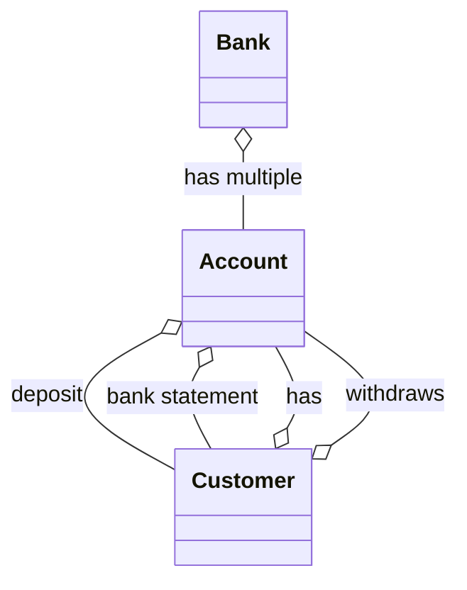

```mermaid
    classDiagram
        class Bank {

        }

        class Customer{

        }

        class Account{

        }

        Bank o-- Account: has multiple

        Customer o-- Account: has
        Customer o-- Account: withdraws
        Account o-- Customer: deposit
        Account o-- Customer: bank statement
```
